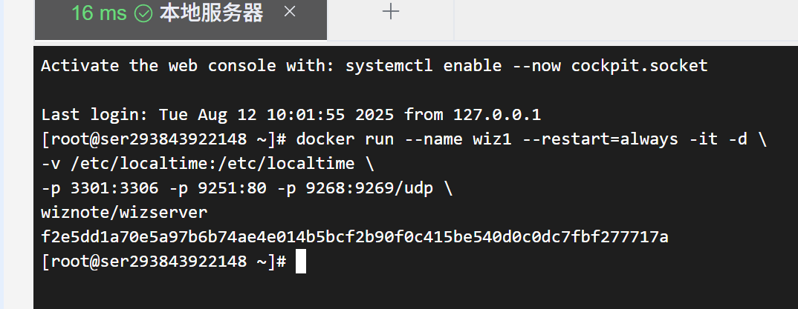
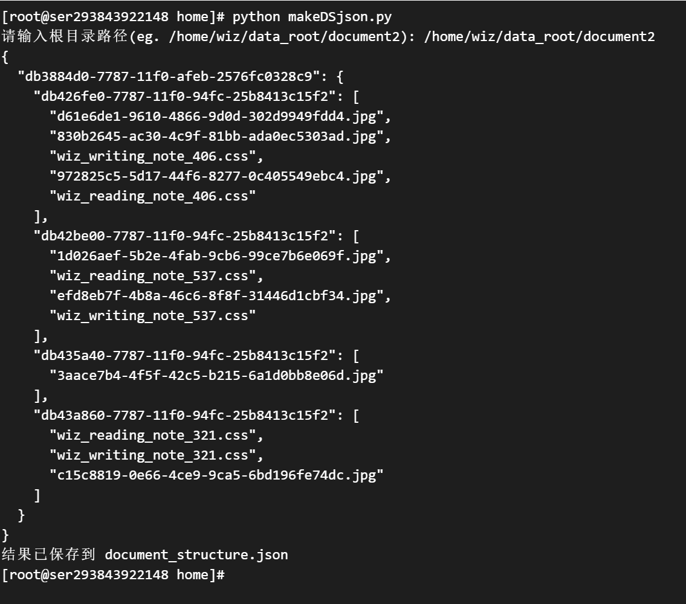
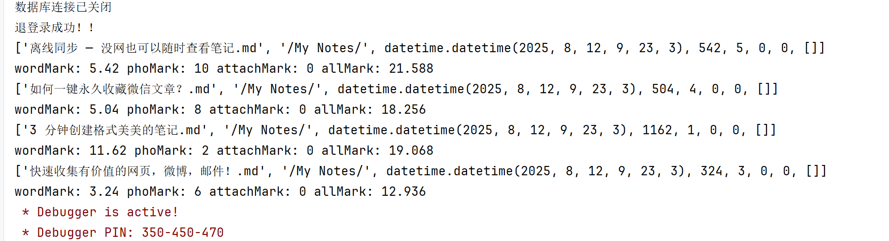
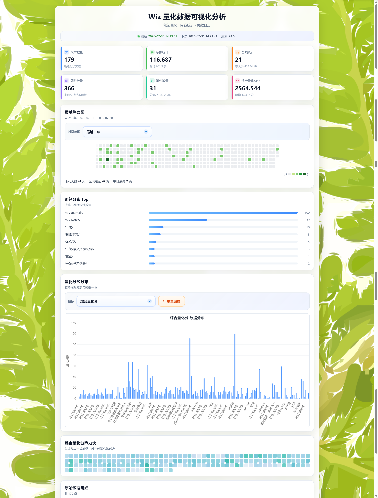

##### 用如下代码启动一个wiz服务
```bash

docker run --name wiz1 --restart=always -it -d \
-v /home/wiz:/wiz/storage \
-v /etc/localtime:/etc/localtime \
-p 3301:3306 -p 9251:80 -p 9268:9269/udp \
wiznote/wizserver
```

##### 在浏览器输入ip:9251/login中看到这个代表启动完成

##### 启动完成后进入容器执行如下命令
```bash
docker exec -it --user root wiz1 /bin/bash  #进入容器
mysql -u root -paI9DCyNpEKWe9pn5 # 进入MySQL
GRANT ALL PRIVILEGES ON *.* TO 'root'@'%' IDENTIFIED BY 'aI9DCyNpEKWe9pn5' WITH GRANT OPTION;
FLUSH PRIVILEGES;
EXIT # 退出MySQL
# 31版本的wiz镜像就已经操作完成
# 按照道理来说31版本的wiz服务端MySQL服务的远程访问现在就已经开启了，但低于这个版本的似乎还需要执行如下代码
pkill mysqld
sed -i 's/^bind-address\s*=\s*127.0.0.1/bind-address = 0.0.0.0/' /etc/mysql/mysql.conf.d/mysqld.cnf
service mysql start

```
##### 开放完MySQL服务后就需要生成document_structure.json文件了
##### 在此之前你一定要先登录web端让容器生成用户数据目录才可以继续接下来的操作
##### 默认用户名admin@wiz.cn 密码123456
##### 登录完成后自己创建一个账号即可
##### 我这里创建2113365920@qq.com  密码111111
##### 执行这个py文件[makeDSjson.py](../makeDSjson.py)
##### 按照要求输入地址就可以看到在文件运行目录有了document_structure.json这个文件了
##### 你只要是用我的命令启动容器这个路径就可以照着我的写


##### 现在你就可以开始跑web服务的代码啦
##### 修改[config.py](../config.py)里面的配置内容，主要是
```python
db_config = {
    'host': '110.40.44.43', # 主机地址
    'database': 'wizksent', # 固定名称
    'user': 'root', # 固定用户
    'password': 'aI9DCyNpEKWe9pn5', # 固定root密码
    'port': 3301 # 你开发的端口
}
wiz_config = {
    'server': 'http://110.40.44.43:9251', # web端地址
    'author': '2113365920@qq.com', # 筛选的作者
    'username': '2113365920@qq.com', #web登录用户名
    'password': '111111', # web登录密码
}
```
##### 修改完毕后直接跑[visualAnalysis.py](../visualAnalysis.py)文件就可以了
##### 看到这个就代表已经成功运行了

##### 在浏览器访问8080端口就可以看到可视化的统计数据啦

##### 目前项目还在开发中...
2026—07—30 更新前端界面

